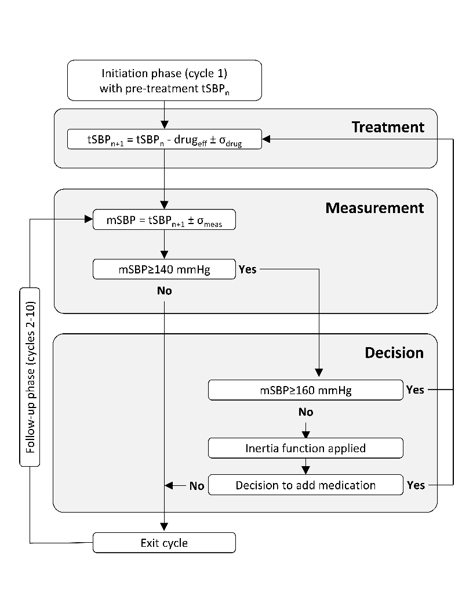
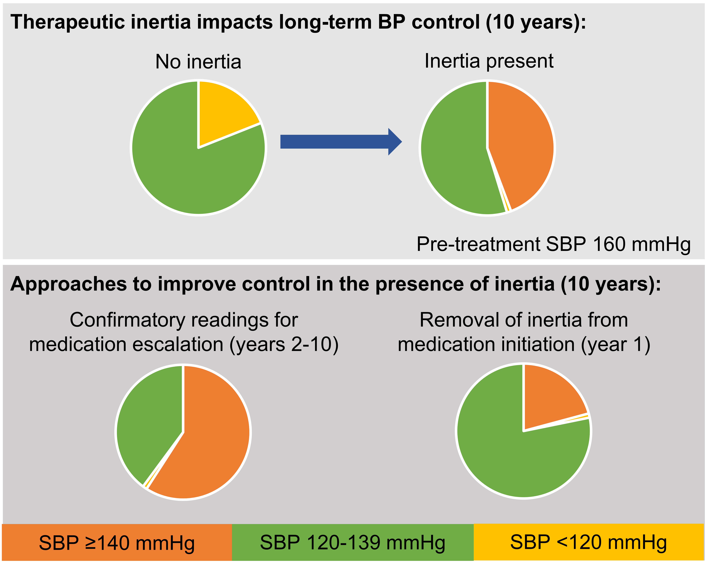

= The Impact of Therapeutic Inertia on Long-term Blood Pressure Control
// :sectnums:
:toc: preamble
:stem: latexmath
:author: Alexandry Augustin et al.
:hypertension-journal: https://www.ahajournals.org/journal/hyp
// :augustin_2021: https://www.ahajournals.org/doi/full/10.1161/HYPERTENSIONAHA.120.15866
:augustin_2021: https://pubmed.ncbi.nlm.nih.gov/33641362/
:phillips_2001: https://pubmed.ncbi.nlm.nih.gov/11694107/
:lebeau_2014: https://pubmed.ncbi.nlm.nih.gov/24989986/
:wang_2007: https://pubmed.ncbi.nlm.nih.gov/17242314/
:okonofua_2006: https://pubmed.ncbi.nlm.nih.gov/16432045/
:git-url: https://git-scm.com/
:git-zip: https://github.com/alexandry-augustin/impact_of_therapeutic_inertia/archive/master.zip
:conda-url: https://conda.io/docs/user-guide/install/

This repository contains the code associated with our {augustin_2021}[research paper].

== Motivation

*Therapeutic inertia* has been defined as the failure of health-care providers to act appropriately during clinical visits (e.g. by initiating or intensifying treatment therapy) when therapeutic goals are not reached [{phillips_2001}[Phillips et al., 2001]]. 
It has been reported that hypertensive individuals experience therapeutic inertia in up to 85% of visits in some European countries 
//[{lebeau_2014}[Lebeau et al., 2014]]
[{wang_2007}[Wang et al., 2007]].
As such, therapeutic inertia is a major obstacle to reaching individual and public-health targets [{okonofua_2006}[Okonofua et al., 2006]]. 

This study assesses the impact of therapeutic inertia on long-term systolic blood pressure (SBP) control and investigate how the inherent variability of BP measurement affects treatment decisions.
A Monte Carlo framework is used to simulate repeated visits in which BP measurements are made with random error, and subsequent treatment decisions are based on probabilities conditioned on measurement values. 
Results show that show that the impact of therapeutic inertia during treatment initiation persists during long-term follow-up. 
Strategies to remove therapeutic inertia during treatment initiation (ie, dual antihypertensive therapy) are likely to improve long-term BP control irrespective of BP measurement technique.

[.center]
.*Model Structure.* Within each cycle, individuals underwent successive treatment steps until measured systolic blood pressure (mSBP) <140 mm Hg or a decision was made not to increased medication. latexmath:[\text{drug}_\text{eff}] indicates mean drug response; tSBP, true systolic blood pressure; latexmath:[\sigma_\text{drug}], SD of drug response; and latexmath:[\sigma_\text{meas}], SD of measurement error.

.Removal of therapeutic inertia from medication improves long-term BP control irrespective of BP measurement technique.

== Software Implementation

All source code used to generate the results and figures in the paper are in the `code` directory.

All results generated by the code are saved in `results`.

=== Getting the Code

You can get a copy of all the files in this repository by {git-zip}[downloading the zip archive]. Or by using the `{git-url}[git] clone` command

[source,bash]
----
git clone git@github.com:alexandry-augustin/impact_of_therapeutic_inertia.git
----

=== Installing the Dependencies

The recommended way to manage the project dependencies is to set up a {conda-url}[conda] virtual environments to avoid conflicts with your existing system Python installation.

Run the following command to create a new environment (Python 3.8.5 and above is required):

[source,bash]
----
conda create -n therapeutic-inertia [python=3.8.5]
----

Run the following command to enable the newly created environment for your current session:

[source,bash]
----
conda activate therapeutic-inertia
----

Any subsequent commands will use dependencies installed in `therapeutic-inertia` environment.

Run the following command to install all required dependencies in the environment:

[source,bash]
----
conda install numpy scipy pandas seaborn scikit-learn
----

=== Reproducing the Results

Before running any code make sure to have installed all the dependencies and that you have activated the `therapeutic-inertia` conda environment (see Section above).

Run the following to produce all results and figures:

[source,bash]
----
cd ./code/
python single_cycle_facetgrid.py
python multiple_cycles_facetgrid.py

cd ./code/
python multiple_cycles_facetgrid.py

cd ./illustrations/
find ./ -name "*.py" -exec python {} \;
----

The figures and data files will be placed in `./code/results`.

== License

All source code is made available under the MIT license. 
You can freely use and modify the code, without warranty, so long as you provide attribution to the authors. 
See link:./LICENSE[LICENSE] for the full license text.